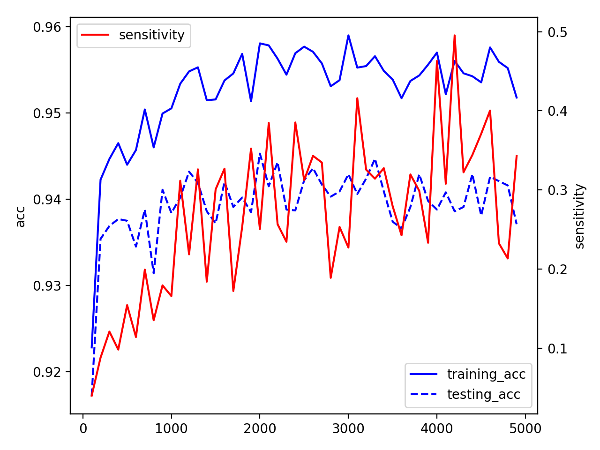
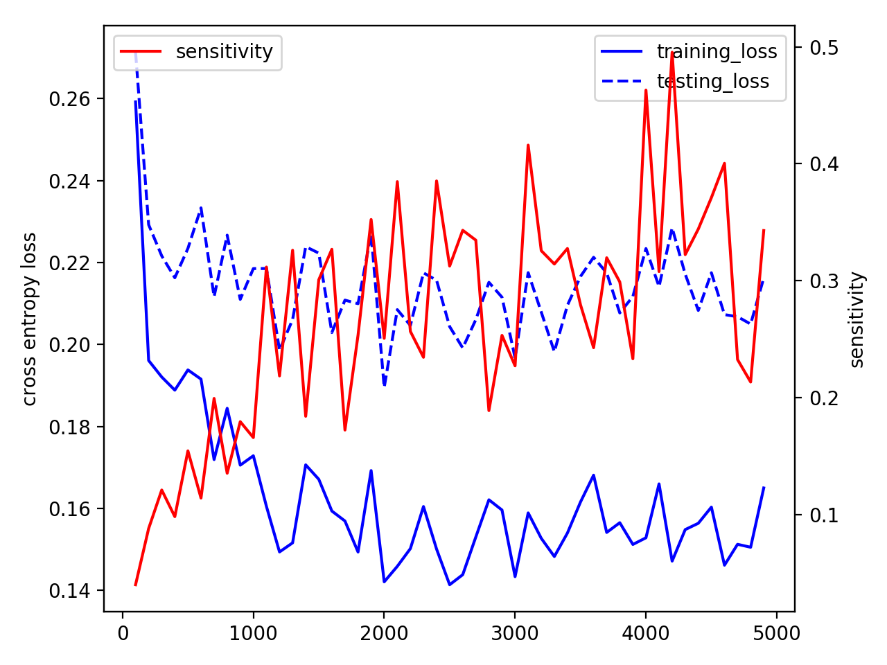

## MLDS Homework 1 Report

b05902127 劉俊緯 b05902013 吳宗翰

<!--Homework 1-1-->
### 1. Deep and Shallow

#### 1-1 Simulate a function

##### 實驗設計
1. Task: $f(x) = sin(x) + cos(x^2)$, 碎形函數(Weierstrass function)
2. Optimizer: Adam, learning rate: $0.01$, batch: $10^4$, iteration: $2 \times 10^5$
3. 網路架構：以下三個DNN model分別為10351, 10367, 10351個參數

- Model 1 (DNN 1 Layer) $Input(1) \rightarrow 3450 \rightarrow Output(1)$

- Model 2 (DNN 3 Layer) $Input(1) \rightarrow 67 \rightarrow 70 \rightarrow 76 \rightarrow Output(1)$

- Model 3 (5 Layer) $Input(1) \rightarrow 50 \rightarrow 50 \rightarrow 50 \rightarrow 50 \rightarrow 50 \rightarrow Output(1)$

##### 實驗結果 

###### A. **$f(x) = sin(x) + cos(x^2)$**

1. Training Loss

2. Predicted x Ground Truth Function Curve

巨觀             |  局部放大
:-------------------------:|:-------------------------:
  |  

###### B. **$f(x) = \sum_{n=0}^{10} (\frac{1}{2})^n cos(2^n \pi x)$**

1. Training Loss

2. Predicted x Ground Truth Function Curve

巨觀            |  局部放大
:-------------------------:|:-------------------------:
  |  

##### 綜合討論

1. 實驗結果的GIF演進圖在 https://imgur.com/gallery/MdENL ，可以看到shallow是沿著x軸一塊一塊的去fit在收斂，deep則在前幾個iteration就在整個x軸上掌握了大部分的特徵，接下來的iteration只是在細部的地方微調而已，估計是模組化的現象。
2. 在function curve大圖上可以看到deep真的好在他產生比較多的pieces，符合上課提到的理論。
3. 從training loss的圖中可以看到越深的網路架構在收斂的過程中震盪比較大，這可能是因為在反向傳播的時候deep前面的參數改了一下會造成比較大的影響
4. 有點可惜的是照理說shallow一開始loss會掉得比較快，但是在這次的圖中不是很明顯

#### 1-2 An actual task

##### 實驗設計
1. Task: MNIST and CIFAR-10
2. Optimizer: Adam, learning rate: $10^{-4}$, loss function: Cross Entropy
3. batch: $100$, iteration: $10^5$
4. 網路架構：

###### A. MNIST：三個Model分別為：50535, 50551, 50598個參數

- Model 1 (CNN * 1 + Dense * 1)
$Input(28 \times 28) \rightarrow Conv (kernel=14 \times 14, filter=5) \rightarrow pool(2 \times 2)$
$\rightarrow Flatten(14 \times 14 \times 5) \rightarrow 50 \rightarrow Output(10)$

- Model 2 (CNN * 1 + Dense * 2)
$Input(28 \times 28) \rightarrow Conv (kernel=14 \times 14, filter=5) \rightarrow pool(2 \times 2)$
$\rightarrow Flatten(14 \times 14 \times 5) \rightarrow 48 \rightarrow 42 \rightarrow Output(10)$

- Model 3 (CNN * 2 + Dense * 2)
$Input(28 \times 28) \rightarrow Conv (kernel=5 \times 5, filter=32) \rightarrow pool(2 \times 2)$
$\rightarrow Conv (kernel=3 \times 3, filter=20) \rightarrow pool(2 \times 2)$
$\rightarrow Flatten(7 \times 7 \times 20) \rightarrow 48 \rightarrow 42 \rightarrow Output(10)$

###### B. CIFAR-10：32938, 32946, 32946個參數

- Model 1 (CNN * 2 + Dense * 1)
$Input(32 \times 32 \times 3) \rightarrow Conv (kernel=3 \times 3, filter=120) \rightarrow pool(2 \times 2)$
$\rightarrow Conv (kernel=3 \times 3, filter=8) \rightarrow pool(2 \times 2)$
$\rightarrow Flatten(8 \times 8 \times 8) \rightarrow 40 \rightarrow Output(10)$

- Model 2 (CNN * 2 + Dense * 3)
$Input(32 \times 32 \times 3) \rightarrow Conv (kernel=3 \times 3, filter=120) \rightarrow pool(2 \times 2)$
$\rightarrow Conv (kernel=3 \times 3, filter=8) \rightarrow pool(2 \times 2)$
$\rightarrow Flatten(8 \times 8 \times 8) \rightarrow 32 \rightarrow 64 \rightarrow 32 \rightarrow Output(10)$

- Model 3 (CNN * 3 + Dense * 2)
$Input(32 \times 32 \times 3) \rightarrow Conv (kernel=3 \times 3, filter=32) \rightarrow pool(2 \times 2)$
$\rightarrow Conv (kernel=3 \times 3, filter=28) \rightarrow pool(2 \times 2)$
$\rightarrow Conv (kernel=3 \times 3, filter=28) \rightarrow pool(2 \times 2)$
$\rightarrow Flatten(4 \times 4 \times 28) \rightarrow 30 \rightarrow 30 \rightarrow Output(10)$

##### 實驗結果

###### A. MNIST

Training Accuracy            |  Training Loss
:-------------------------:|:-------------------------:
|  

###### B. CIFAR-10

Training Accuracy            |  Training Loss
:-------------------------:|:-------------------------:
|  

##### 綜合討論
1. 由於loss decrease的震盪太大，因此我們選擇數個iteration做一次平均，如此一來能比較清楚的看到整體的走向
2. 在接近參數的狀況下(綠色和橘色的比較中)，多一層CNN, Max_pooling比起多一層DNN的還來得好
3. 在接近參數的狀況下(藍色和橘色的比較中)，deep的確實比shallow的還來得好，符合我們上課所提到的理論

<!--Homework 1-2-->
### 2. Optimization

#### 2-1 Visualize the optimization process

##### 實驗設計
1. Task: fit a designed function $f(x) = sin(x) + cos(x^2)$
2. 每3個iteration就記錄一次所有的參數
3. 網路架構：DNN
	- $Input(1) \rightarrow 10 \rightarrow 10 \rightarrow 10 \rightarrow 10 \rightarrow Output(1)$
4. Dimension Reduction method
	- 使用sklearn套件的PCA直接把高維度降成二維，並沒有加上其他的參數

##### 實驗結果

Whole model           |  Layer 1
:-------------------------:|:-------------------------:
|  

##### 綜合討論

1. 不管是whole model或者是layer1的圖都可以看到參數是由某個點向外發散的，我們可以解讀為初始值只要有一點不同，network的optimization process就會不同，最後也收斂到不同的地方，這正巧呼應了上課所提到「分水嶺」的概念
2. whole model和layer1的圖表現的不同也很好理解，畢竟Layer 1的參數只佔總參數的1成不到，因此用PCA降維後的結果也不同

#### 2-2 Observe gradient norm during training

##### 實驗設計
1. Task: MNIST, 每個iteration都紀錄loss和gradient norm (使用DNN)

##### 實驗結果

Gradient norm           | Loss
:-------------------------:|:-------------------------:
|  

##### 綜合討論
1. 圖中看到最開始gradient norm很低只是因為初始化剛好在那裡而已
2. 雖然不是很明顯，不過整體而言gradient norm還是隨著loss下降而跟著在下降
3. 除了這個規定的實驗，我們在2-3也有發現到與2-2相同的結果。(下面有寫)此外，gradient norm不是很穩定，我們合理推測是因為有momentum的效果在才會這樣。(我們使用adam optimizer。)

#### 2-3 What happens when gradient is almost zero?

##### 實驗設計
1. Task: fit designed function $f(x) = sin(x) + cos(\frac{x^2}{10})$ (small DNN network)
2. Find gradient norm almost zero by changing objective function
	- 前$5000$個iteration: Minimize loss
	- 後$10000$個iteration: Minimize norm
3. Minimum ratio
	- 定義就如同課堂上所述的"proportion of eigenvalues greater than zero"
	- 使用tensorflow內建的`tf.hessians()`計算，並視他是diagonal的矩陣

##### 實驗結果

##### 綜合討論
1. 由上圖我們可以發現在$loss < 0.1$的狀況下，大部分的minimum ratio也都比0.5還來得高，因此我們覺得minimum ratio的這個理論還算是成功
2. 此外還有發現一件事情： 當前5000個iteration已經收斂到不錯的結果的時候，在minimize norm的時候loss也會下降，這也符合了2-2的討論：當gradient norm是0的時候loss通常也會很低；但是相反的，只要不收斂，就很容易噴高，這也反應了在神經網路的error surface非常崎嶇的，只要沒有好好掉一個洞，很容易就跑到saddle point或比較不好的minima。

#### 2-4 Visualize Error Surface (Bonus!)

##### 實驗設計
1. Task: fit designed function $f(x) = sin(x) + cos(\frac{x^2}{5})$
2. Optimizer: Adam, batch: 20000, iteration: 40000
3. 網路架構：DNN
	- $Input(1) \rightarrow 4 \rightarrow 4 \rightarrow Output(1)$
4. 觀察Error Surface的方法: random打點
	- 每層layer都有0.1機率會是亂數，亂數會與原本的數據差uniform(-0.1,0.1)，藉此來達到亂數打點
	- 另外因為我們選擇的function較為崎嶇，為了方便做出error surface，我們在iteration >5000的時候才開始打點，每次打50個點。

5. Dimension Reduction: 先使用PCA降一點點維度再使用TSNE把它降到2D, 3D

##### 實驗結果

 Dim = 2            |  Dim = 3
:-------------------------:|:-------------------------:
|   

##### 綜合討論
1. 從3D的圖中我們可以看到error surface相當的崎嶇，而看起來gradient descent的路上也繞了不少路
2. 另外在2D的圖中，藍色是error低的，紅色是error高的。在這個圖裡面可以明顯的看出來它的確是有沿著某種路從高的loss往低的loss走。

<!--Homework 1-3-->
### 3. Generalization

#### 3-1 Can network fit random labels?

##### 實驗設計
1. Task: MNIST
1. Optimizer: Adam, learning rate: $10^{-4}$, loss function: Cross Entropy
2. batch: $100$, iteration: $3 \times 10^4$
3. 網路架構：DNN
	- $Input(28 \times 28) \rightarrow 700 \rightarrow 700 \rightarrow 700 \rightarrow Output(10)$

##### 實驗結果

Accuracy           |  Loss
:-------------------------:|:-------------------------:
|  

##### 綜合討論
1. MNIST的總維度是$28 \times 28 \times 255$，在實驗中我們所用的總參數比他還大，因此做出training accuracy=1.0是有可能的
2. 因為random label會使得要區分的VC dimension比原本更大，因此不但要較多的parameters才能去fit，收斂速度也會更慢。這也可以解釋在random pixel的時候，parameters都要比之前更來的多，收斂速度也更慢。

#### 3-2 Number of parameters v.s. Generalization

##### 實驗設計
1. Task: train MNIST for 100 次
2. Optimizer: Adam, loss function: Cross Entropy
3. batch: $10^3$, iteration: $5 \times 10^3$
4. 每次training都使用DNN，不過不同的點如下表所示：

參數 | uniform distrubution區間
----- | -----
learning rate 	| $[10^{-3}, 10^{-5}]$
	layer層數  	| $[2, 4]$
	每層neuron數	 | 較多者: base = randint(25, 2000)，依此每層random相差20-200個neuron不等  較少者: base = randint(1, 5)，依此每層相差至多3個neuron不等 (其實只是為了曲線漂亮)

##### 實驗結果

Accuracy           |  Loss
:-------------------------:|:-------------------------:
|  

##### 綜合討論
1. 從圖中可以看到隨著parameter的增加，不但training loss不斷地下降，連testing loss也跟著下降
2. 上面的結果一反我們傳統認為可能overfitting的狀況，雖然不知道為什麼會如此，不過總之就覺得deep learning實在是太神奇了

#### 3-3 Flatness v.s. Generalization

#### A. Two model interpolation

##### 實驗設計
1. Task: MNIST, 係數$-1.0 < \alpha < 2.0$, Optimizer: Adam, learning rate: $10^{-4}$
3. ​batch: 分別為1024以及64, iteration: 40000
4. 網路結構：DNN
	- $Input(28 \times 28) \rightarrow 15 \rightarrow 15 \rightarrow Output(10)$

##### 實驗結果

##### 綜合討論
1. 有關於Cross Entropy的解釋：
	- 在$\alpha = 0.0, 1.0$兩個點的cross entropy是圖中的最小值，可以知道network是有學到東西的
	- 在$\alpha = [0, 1]$的區間中cross entropy都相對的低可以猜測兩個model都掉到比較flatness的地方
	- 在$\alpha < 0, \alpha > 1$的地方cross entropy都節節上升，可以猜測當初gradient descent時兩個model可能是從兩側滾下來的
2. 有關於Accuracy的解釋：
	- 圖中大部分的地方都呈現了Accuracy和Cross Entropy的趨勢相反，這相當的符合直覺

#### B. Sensitivity

##### 實驗設計
1. Task: MNIST, Optimizer: Adam, learning rate: $10^{-4}$
3. ​batch: `range(100, 5000, 100)` , iteration: 200000
4. 網路結構：DNN
	- $Input(28 \times 28) \rightarrow 10 \rightarrow 10 \rightarrow 10 \rightarrow Output(10)$

##### 實驗結果

Accuracy           |  Loss
:-------------------------:|:-------------------------:
|  

##### 綜合討論
1. 實驗結果發現Sensitivity的高低好像沒有辦法預測testing accuracy的好壞
2. 實驗結果發現越大的batch size所得到的sensitivity越高，跟助教做出來的不太一樣，不過卻和我們自己定義的Sharpness(下面一題)所看到的結果相似

#### C. Sharpness (Bonus!)

##### 實驗設計
1. Task: MNIST, Optimizer: Adam, learning rate: $10^{-4}$
3. batch: `range(100, 4000, 100)`
4. 網路結構：DNN
	- $Input(28 \times 28) \rightarrow 10 \rightarrow 10 \rightarrow Output(10)$

5. Evaluate Generalization的方法
	- 在跑了10000個epoch後(也就是等到它收斂到比較好的結果的時後)，開始random打點。打點方式跟1-2bonus一樣。不同的是我們打了10000個點。
	- 在上述的random的distribution下，對周圍的點的loss取mean。
所以mean(loss)越高表示它越尖，shapness越大，因此我們自行衡量sharpness方式就是：**10000次random打點所得到的loss平均**

##### 實驗結果

Accuracy           |  Loss
:-------------------------:|:-------------------------:
|  

##### 綜合討論
1. 和上課提到的結論一樣，在batch越大的地方sharpness平均來說比較高
2. sharpness高的地方accuracy普遍低, loss普遍高也跟課堂結論一樣

##### Appendix: 分工表

- B05902013 吳宗翰
	- $\frac{1}{4}$ HW1-1 + $\frac{1}{2}$ HW1-2
	- All report
- B05902127 劉俊緯
	- $\frac{3}{4}$ HW1-1 + $\frac{1}{2}$ HW1-2 + All HW1-3
	- All bonus
