# MLDS Homework 1 Report

b05902127 劉俊緯 b05902013 吳宗翰

<!--Homework 1-1-->
## 1. Deep and Shallow

在作業1-1中，我們將比較deep和shallow兩個network架構在參數量相同的時候的表現及其收斂過程。以下我們將做兩個實驗:實驗一是試著去fit一個函數、實驗二則是去做真實生活中的case，如MNIST和CIFAR-10。

### 1-1 Simulate a function

在這個實驗中，我們選用兩個函數，其中一個是 $f(x) = sin(x) + cos(x^2)$;另外一個則是著名的碎形函數Weierstrass function，以下我們將分別討論其實驗過程與結果。

#### 實驗設計

1. Optimizer: Adam, learning rate: $0.01$, loss function: square loss
2. batch: $10^4$, epoch: $2 \times 10^5$
3. 訓練範圍：$[0.0, 10.0]$，間隔$0.001$
4. 網路架構：以下三個model分別為10351, 10367, 10351個參數

```mermaid
graph TD

subgraph Model 3
A["Input (None, 1) -> (None, 50)"]
B["DNN (None, 50) -> (None, 50)"]
C["Output (None, 50) -> (None, 1)"]

A --> B 
B -->|hidden layer再連續3個50*50| C 
C --> G
end

subgraph Model 2
H["Input (None, 1) -> (None, 67)"]
I["DNN (None, 67) -> (None, 70)"]
J["DNN (None, 70) -> (None, 76)"]
N["Output (None, 76) -> (None, 1)"]

H --> I 
I --> J 
J --> N
end

subgraph Model 1
O["Input (None, 1) -> (None, 3450)"]
U["Output (None, 3450) -> (None, 1)"]

O --> U
end

```

<!-- 

 -->

#### 實驗結果 

##### A. **$f(x) = sin(x) + cos(x^2)$**

1. Training Loss

2. Predict Result

巨觀             |  局部放大
:-------------------------:|:-------------------------:
  |  

##### B. **$f(x) = \sum_{n=0}^{10} (\frac{1}{2})^n cos(2^n \pi x)$**

1. Training Loss
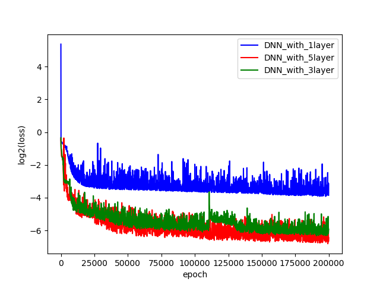

2. Predict Result

巨觀            |  局部放大
:-------------------------:|:-------------------------:
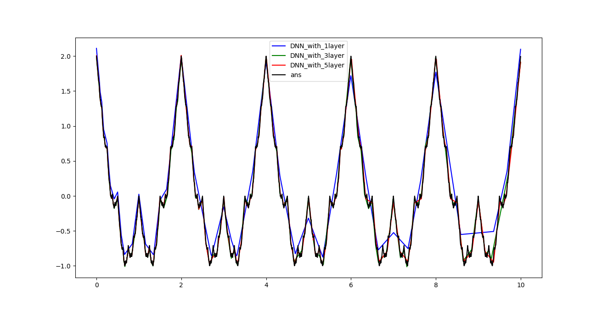  |  

#### 綜合討論

1. 實驗結果的GIF演進圖在https://imgur.com/gallery/MdENL
2. 在GIF上面可以看到shallow在收斂過程中是沿著x軸一塊一塊的去fit，然而在deep的架構下則有發現模組化的現象。在前幾個epoch就在整個x軸上掌握了大部 分的特徵，在接下來的 epoch只是在細部的地方微調而已。
3. 在兩個函數大圖result上面可以看到deep可以fit比較好是因為他產生比較多的pieces，在折角處都表現得較好，這個也是符合理論。
4. 從predict result中可以看到越深的網路架構在收斂的過程中震盪比較大，這是因為 在反向傳播的時候deep前面的參數改了一下會造成比較大的影響
5. 有點可惜的是照理說shallow一開始loss會掉得比較快，但是在這次的圖中不是很明顯

### 1-2 An actual task

在這個實驗中，我們將比較deep和shallow網路在fit an actual task上的Accuracy與Training Loss的差別，以下將分別train在MNIST以及CIFAR-10上面：

#### 實驗設計

1. Optimizer: Adam, learning rate: $10^{-4}$, loss function: Cross Entropy
2. batch: $100$, epoch: $10^5$
3. 網路架構：

##### A. MNIST：50545, 50551, 50598個參數

##### B. CIFAR-10：32938, 32946, 32946個參數

#### 實驗結果

##### A. MNIST

Training Accuracy            |  Training Loss
:-------------------------:|:-------------------------:
  |  

##### B. CIFAR-10

Training Accuracy            |  Training Loss
:-------------------------:|:-------------------------:
 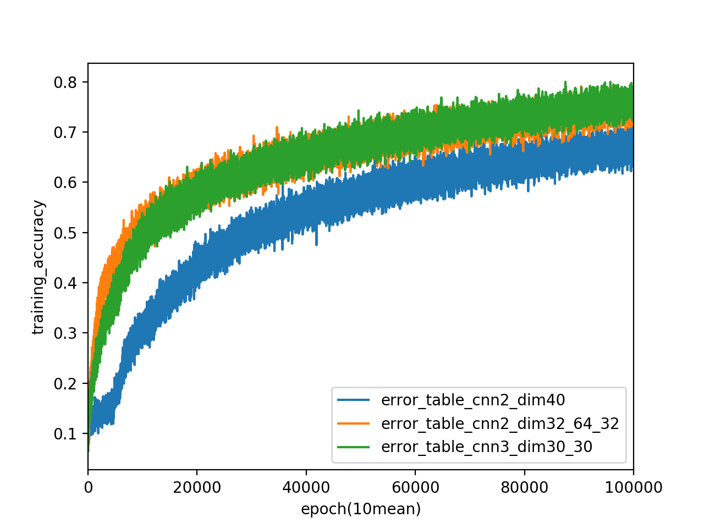  |   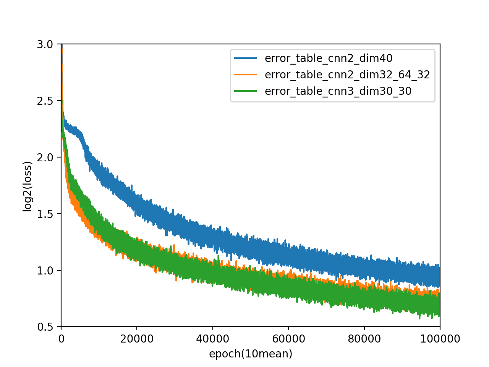

#### 綜合討論
1. 由於loss decrease的震盪太大，因此我們選擇數個epoch做一次平均，如此一來能比較清楚的看到整體的走向
2. 在接近參數的狀況下(綠色和橘色的比較中)，多一層CNN, Max_pooling比起多一層DNN的還來得好
3. 在接近參數的狀況下(藍色和橘色的比較中)，deep的確實比shallow的還來得好，符合我們上課所提到的理論

<!--Homework 1-2-->
## 2. Optimization
在作業1-2中，我們將致力於可視化network在optimization的過程。以下我們將做三個實驗，分別觀察：(1)多次training中dimension reduction後參數變化的情形 (2)gradient norm隨著loss下降的變化 (3)利用Hessian Matrix輔助我們觀察gradient接近0的時候是否ㄋ走到local minimum。

### 2-1 Visualize the optimization process

#### 實驗設計
1. Optimizer: Adam, learning rate: $0.01$, loss function: Cross Entropy
2. batch: $128$, epoch: $4000$
3. 每3個epoch就記錄一次所有的參數
4. 網路架構：

##### MNIST train 在簡單的DNN上，共16750個參數
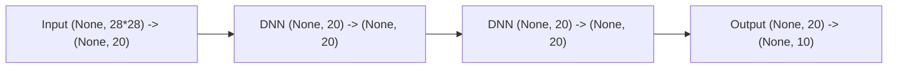

##### Dimension Reduction

使用現成sklearn套件的PCA把高維度降成二維，並沒有加上其他的參數

#### 實驗結果

1. Whole Model

巨觀           |  局部放大
:-------------------------:|:-------------------------:
  |  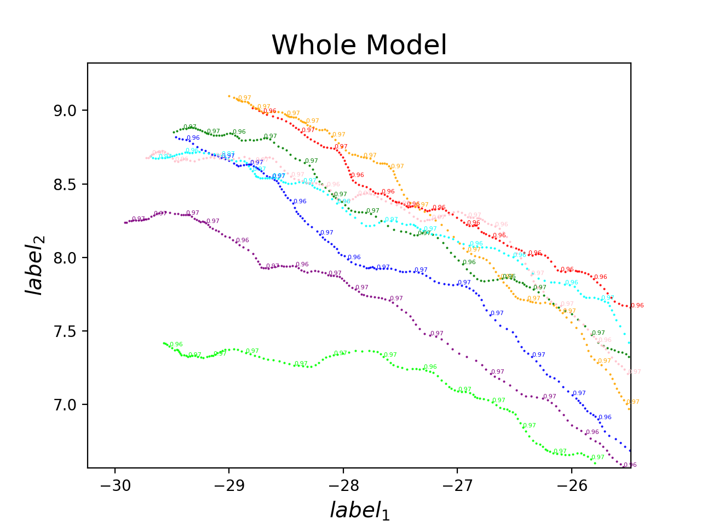

2. Only Layer-1

巨觀           |  局部放大
:-------------------------:|:-------------------------:
  |  

#### 綜合討論

1. 由圖中train 8次的圖都很像可以推測我們可能是收到同一個local minimum
2. whole model和layer 1表現類似可能是因為這個neural network中layer 1佔總parameter量的80%以上，因此就dominate了

### 2-2 Observe gradient norm during training

在training process中，我們總致力於讓gradient=0，而在這次的實驗中，我們將觀察在network找尋答案的過程中，gradient norm將如何變化。以下實驗我們使用DNN train在MNIST上面。
#### 實驗設計
1. Optimizer: Adam, learning rate: $0.01$, loss function: Cross Entropy
2. batch: $100$, epoch: $3 \times 10^4$
3. 每個epoch都紀錄loss和gradient norm
4. 網路架構：
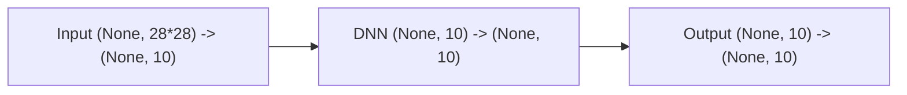

#### 實驗結果

Gradient norm           |  Loss
:-------------------------:|:-------------------------:
  |  

#### 綜合討論
1. 圖中看到最開始gradient norm很低只是因為初始化剛好在那裡而已
2. 雖然不是很明顯，不過整體而言gradient norm還是隨著loss下降而跟著在下降

### 2-3 What happens when gradient is almost zero?

在這次的實驗中，我們希望能利用hessian matrix來觀察在training的過程中gradient很小的時候是收斂到saddle point還是local minimum。以下實驗我們將train在fit a function上面，選用的函數是$f(x) = sin(x) + cos(\frac{x^2}{10})$。

另外在這題中我們去逼近$gradient=0$的方式就是change objective function。

#### 實驗設計

##### A. Minimize loss
1. Optimizer: Adam, learning rate: $0.001$, loss function: square loss
2. batch: $10^4$, epoch: 前$5000$
3. 網路架構
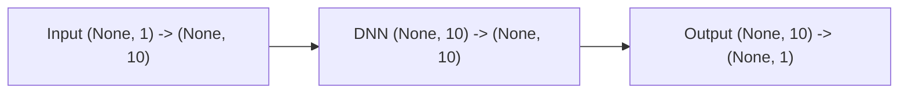

##### B. Minimize norm
1. Optimizer: Adam, learning rate: $0.0001$, loss function: norm
2. batch: $10^4$, epoch: 後$10000$

##### C. Minimum ratio
1. 定義就如同課堂上所述的"proportion of eigenvalues greater than zero"
2. 在本題中使用tensorflow內建的`tf.hessians()`，並且視他是diagonal的矩陣

#### 實驗結果

下圖為我們train 100次的結果：

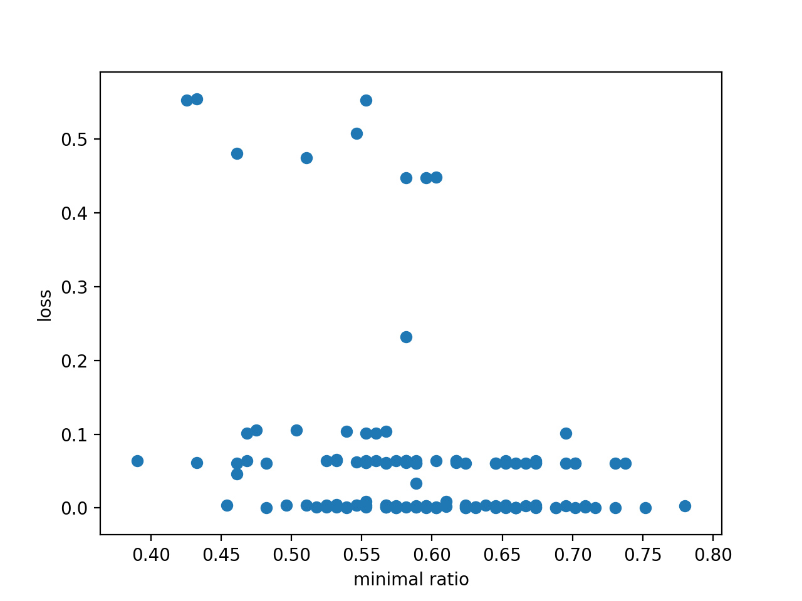

#### 綜合討論
1. 由上圖我們可以發現在$loss < 0.1$的狀況下，大部分的minimum ratio也都比0.5還來得高，因此我們覺得minimum ratio的這個理論還算是成功

### 2-4 Visualize Error Surface (Bonus!)

在這次的實驗中，我們將試著可視化network的error surface，以下我們將train在fit a function上，選用的函數是$f(x) = sin(x) + cos(\frac{x^2}{5})$。

#### 實驗設計

##### A. 訓練模型
1. Optimizer: Adam, learning rate: $0.01$, loss function: square loss
2. batch: $40000$, epoch: $20000$

##### B. 觀察Error Surface的方法

##### C. Dimension Reduction

#### 實驗結果

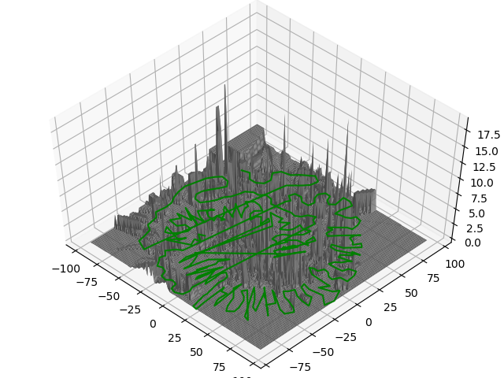

#### 綜合討論

<!--Homework 1-3-->
## 3. Generalization

### 3-1 Can network fit random labels?

本次實驗我們將看看deep learning有沒有能力學起random label，藉此觀察generalization的情況，以下實驗我們將train在MNIST上面。

#### 實驗設計
1. Optimizer: Adam, learning rate: $10^{-4}$, loss function: Cross Entropy
2. batch: $100$, epoch: $3 \times 10^4$
3. 網路架構：DNN
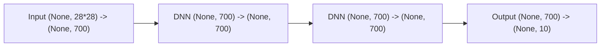

#### 實驗結果

Accuracy            |  Loss
:-------------------------:|:-------------------------:
  |  

#### 綜合討論
1. MNIST的總維度是$28 \times 28 \times 255$，在實驗中我們所用的總參數比他還大(也就是VC dimension過大)，因此做出training accuracy=1.0是有可能的
2. 比起正常的label，發現random label需要更多的parameter才能去fit

### 3-2 Number of parameters v.s. Generalization

在這次實驗中我們將嘗試多種network structure，並且針對parameter v.s. generalization做討論，這次我們也是train在MNIST上面。

#### 實驗設計
1. Training 100次
2. Optimizer: Adam, loss function: Cross Entropy
3. batch: $10^3$, epoch: $5 \times 10^3$
4. 每次training都使用DNN，不過不同的點如下表所示：

參數 | uniform distrubution區間
----- | -----
learning rate 	| blah
	layer層數  	| $[10^{-5}, 10^{-3}]$
	每一層的neuron數量	 |	blah

#### 實驗結果

Accuracy            |  Loss
:-------------------------:|:-------------------------:
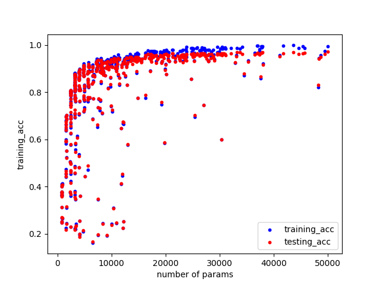  |  

#### 綜合討論
1. 從圖中可以看到隨著parameter的增加，不但training loss不斷地下降，連testing loss也跟著下降
2. 上面的結果一反我們傳統認為可能overfitting的狀況，雖然不知道為什麼會如此，不過總之就覺得deep learning實在是太神奇了

### 3-3 Flatness v.s. Generalization

在這個task中我們將train在MNIST上面，第一個實驗我們將

#### A. Two model interpolation

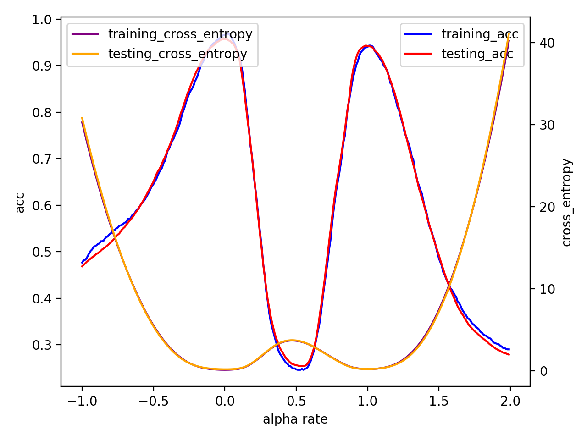

#### B. Sensitivity

#### C. Sharpness (Bonus!)

#### Appendix: 分工表

- HW 1-1: b05902013: 一半的function, b05902127: 一半的function + actual task
- HW 1-2: b05902103: 1-2-1, 一半的1-2-2, b05902017: 一半的1-2-2, 1-2-3, bonus
- HW 1-3: b05902127: all
- Report: b05902013: all