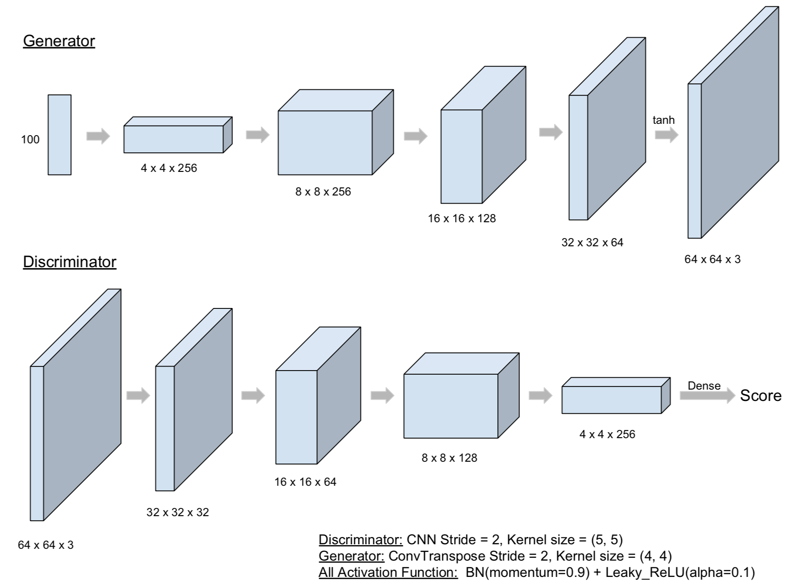
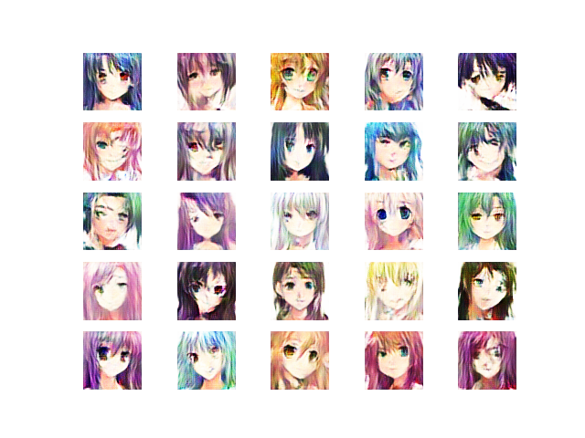
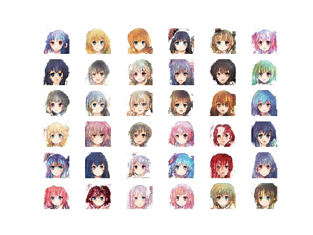
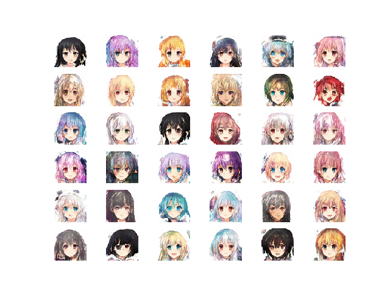
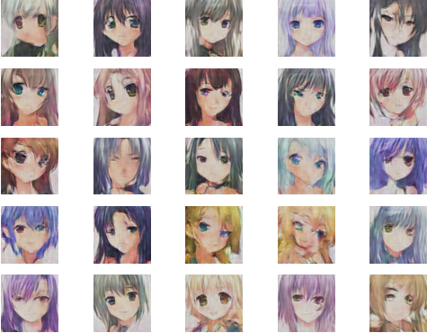
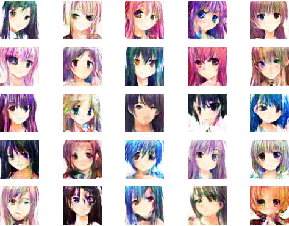
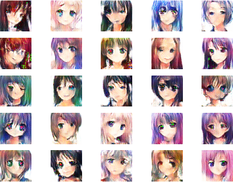
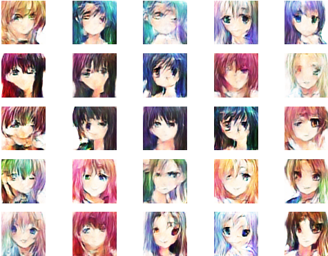
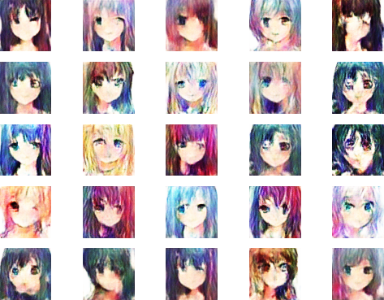
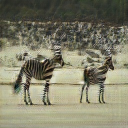

## MLDS Homework 3 Report

b05902127 劉俊緯 b05902013 吳宗翰

### Model Description

##### <u>1. Image Generation</u>

1. Model

</img>

2. Training Method

  - Preprocessing: $x' = \frac{x-127.5}{127.5}$，先把image中的所有數字都會被壓在[-1, 1]中
  - batch size: 32
  - Loss function: WGAN-GP的Loss function 
  	- Constraint項的 $\lambda = 10$
  	- Linear interpolation的 $\alpha \sim U(0, 1)$
  - Optimizer: Generator跟Discriminator都是Adam (beta1=0.5, beta2=0.9)
    - 前20000個iteration: lr=$10^{-4}$
    - 後10000多個iteration: lr = $10^{-5}$
  - 每次Discriminator跟Generator是4:1的訓練

##### <u>2. Text-to-image Generation</u>

1. Model
   
   * add batch norm$(0.9,0.999)$ and leaky relu$(0.2)$ between every transform without output layer and input layer.
     * generator output's acivation is $tanh$.
   * all convolution layer and deconvolution layer are setting to $strides=(2,2) , filter\,\,size=(5,5)$ except the last conv in the generator.
     * the last conv in generator is conv2d([1,1],[1,1]). 
       * I think that it's similar to ensemble.
   * We try to train in large scale image, and hope it will be clear than transform to $64 \times 64$
2. Training Method and details
   * Preprocessing: image normalize to $[-1,1]$.
   * Batch size: 32
   * Loss Function:
     * DRAGAN's constraint $\lambda = 8$
     * Spherical interpolation's $\alpha = (0,1)$

   

### Experiment settings and observation

##### <u>1. Image Generation</u>

training的參數在上面已經有寫到了，可以發現當epoch到達10的時候圖片已經蠻完整的了(大約三個小時)
接著從10到30多的時候其實都是差不多的圖片。以下附上training過程的圖片：

|   epoch 10    |   epoch 20   |
| :-----------------------: | :------------------------: |
|  |  |
|   epoch 30    |   Reproduce照片   |
|  |  |

##### <u>2. Text-to-image Generation</u>

|Itrs|pic|
|-|-|
|1600||
|3200||
|20000||

* 從一開始的1600 Iterations，我們得知GAN已經學習好眼睛和頭髮的位置。
* 而train到後面，20000 iterations時，與之前的圖片相比，頭髮分的較為清楚，並且有光澤。
* Training Details:
  - 0-10000 iterations: 
    - learning rate = $10^{-4}$
    - discriminator : generator =  4 : 1
  - 10000-20000 iterations: 
    - learning rate = $10^{-5}$ 
    - discriminator : generator =  4 : 1
  - Ensemble 4 discriminator.
* In inference, in order to decay the probability of bad picture, we generate 512 picture per one target picture, and pick the one that is the highest score judging by our discriminator.

### Compare Vallina GAN with WGAN-GP

|   Vallina GAN    |   WGAN-GP    |
| :-----------------------: | :------------------------: |
|  |  |

本次作業我繳交的作業是使用WGAN-GP所train出來的模型，在本題中我想比較我的model與最基本的vallina GAN之間的差別。

- Training過程
	- WGAN-GP基本上不太需要手動做Generator和Discriminator之間的平衡，training的過程相對穩定許多；反之Vallina GAN會需要手動寫個rule在其中一方太強的時候就停止。
	- Vallina GAN在得到好圖片後繼續train下去會崩掉，像是整張照片出現很多類似頭髮狀的弧線，然而WGAN-GP並不會有這樣的狀況
	- Vallina GAN的training較快，反之WGAN-GP的training速度會被gradient penalty計算的時間拖慢一些

- 結果
雖然Vallina GAN以及WGAN-GP都可以讓人臉完整呈現，不過看起來Vallina GAN所產生的顏色並不是很好看，畫面偏灰會讓人覺得髒髒的。

### Training tips for improvement

##### <u>1. Normalize the input</u>

|   Original    |   Normalize    |
| :-----------------------: | :------------------------: |
|  |  |

- 比較項目
Original這組只是把圖片除255，讓數字掉在$[0, 1]$，Normalize組則是$x'=\frac{x-127.5}{127.5}$讓數字掉在$[-1, 1]$。Generator output layer的Activation function都是tanh。

- 分析
雖然generator output layer的activation是tanh，不過在對照組中產生的圖片都沒有負值，估計是因為有負的應該就會直接被Discriminator抓到。不過沒有Normalize的圖片中卻出現有些許的綠色壞點，顯示在Optimize的過程中，他過度的去貼近+1。經由以上比較，我們覺得
Normalize確實會讓GAN的performace變好。

##### <u>2. Avoid Sparse Gradients: ReLU, MaxPool</u>

|   Original    |   Leaky_ReLU    |
| :-----------------------: | :------------------------: |
|  |  |

- 比較項目
在都有做Normalize的狀況下，比較使用sparse gradient的relu (original)以及使用leaky_relu(0.2)的差別

- 分析
實驗結果顯示其實差不了多少，甚至是leaky_relu這組有些頭髮糊掉了，因此我們覺得這個tips不見得有絕對的優劣。

##### <u>3. BatchNorm</u>

|   Original    |   BatchNorm    |
| :-----------------------: | :------------------------: |
|  |  |

- 比較項目
在都有做Normalize, Leaky_ReLU(0.1)的狀況下，比較有無在每一層都加上batchnorm的差別。

- 分析
實驗結果顯示有batchnorm這組明顯表現得比較好，尤其像是壞臉變少、顏色更細緻等等。另外在training上面batchnorm每個epoch都跑得比較慢，不過也在很前面的epoch就能表現出能看的結果，整體而言覺得有batdchnorm還是比較好。

### Style Transfer

##### <u>1. My result</u>

|   Input Domain — Horse    |   Output Domain — Zabra    |
| :-----------------------: | :------------------------: |
|  |  |

##### <u>2. Analysis</u>

- Model

	- 使用Cycle GAN，同時train了zebra2horse以及horse2zebra，兩個都是LSGAN (Least Square GAN)

- Observation
	- 斑馬旁邊的地方會有奇怪的糊糊的地方，如馬腳、馬尾巴等等
	- 上方的草地有些也被轉變成斑馬的紋路，顯示其實這個performance還不是非常非常好

##### <u>3. Reference</u>

在Homework 3-3 Style Transfer中，我們是拿Github上面的原始碼只是做Inference，因此在此我們也附上model的來源：

https://github.com/vanhuyz/CycleGAN-TensorFlow

##### 分工表
- 3-1: b05902013 吳宗翰
- 3-2: b05902127 劉俊緯
- 3-3: b05902013 吳宗翰 
