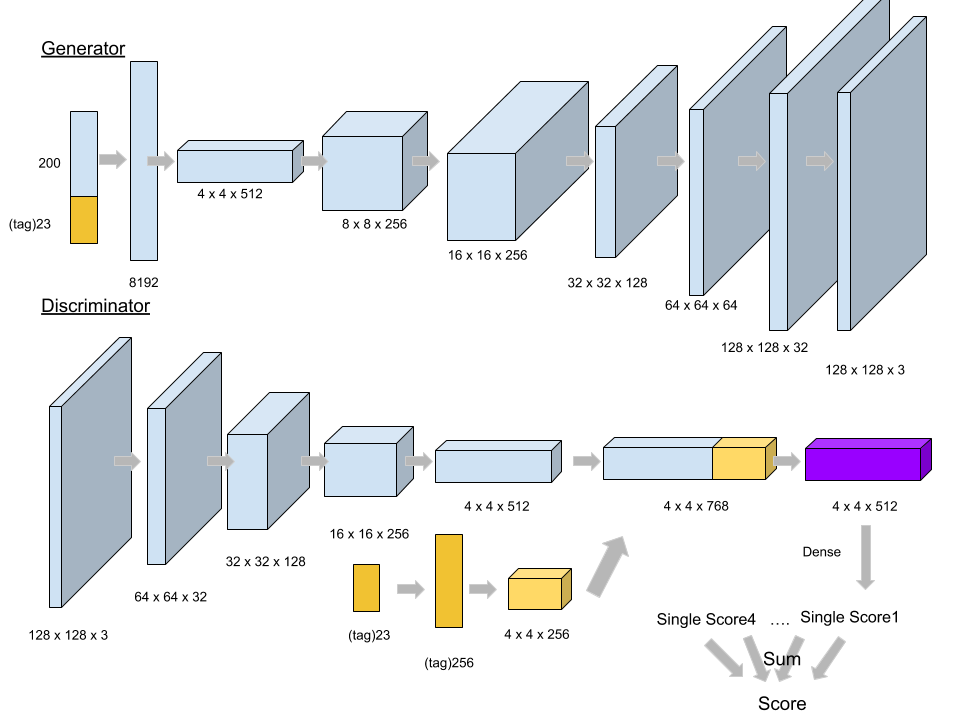

### Model Description

#### 2. text-to-image generation

1. Model
   
   * add batch norm$(0.9,0.999)$ and leaky relu$(0.2)$ between every transform without output layer and input layer.
     * generator output's acivation is $tanh$.
   * all convolution layer and deconvolution layer are setting to $strides=(2,2) , filter\,\,size=(5,5)$ except the last conv in the generator.
     * the last conv in generator is conv2d([1,1],[1,1]). 
       * I think that it's similar to ensemble.
   * We try to train in large scale image, and hope it will be clear than transform to $64 \times 64$
2. Training Method and details
   * Preprocessing: image normalize to $[-1,1]$.
   * Batch size: 32
   * Loss Function:
     * DRAGAN's constraint $\lambda = 8$
     * Spherical interpolation's $\alpha = (0,1)$
   * Training Details:
     * 0-10000 iterations: 
       * learning rate = $10^{-4}$
       * discriminator : generator =  4 : 1
     * 10000-20000 iterations: 
       * learning rate = $10^{-5}$ 
       * discriminator : generator =  4 : 1
     * Ensemble 4 discriminator.
   * In inference, in order to decay the probability of bad picture, we generate 512 picture per one target picture, and pick the one that is the highest score judging by our discriminator.

### Experiment settings and observation

2. text-to-image generation

