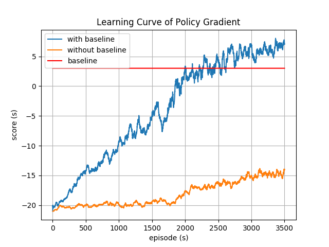

MLDS HW4-1 - Gradient Policy 
---

### Describe your Policy Gradient model (1%)

#### Model

| layer  | RGB image from observation     | Shape                      |
| ------ | ------------------------------ | -------------------------- |
| perpro | TA的preprocess code.           | observation -> 80*80 image |
| hidden | Dense(128 , activation='relu') | (None,6400) -> (None,128)  |
| output | Dense(6,activation='softmax')  | (None,128) -> (None,6)     |

#### Details

| Details        | Parameteres                   |
| -------------- | ----------------------------- |
| Optimizer      | pyTorch's 預設 Adam， lr=1e-4 |
| Discount value | 0.99                          |

### Plot the learning curve to show the performance of your Policy Gradient on Pong (1%)

### Implement 1 improvement method on page 8
#### Describe your tips for improvement (1%)

* variance reduction - 加入 baseline
* 我們使用最靠近現在的10000步的rewards(包含被discount的部份)作為我們的mean。
* 要更新參數的時候，計算loss前的reward會-= mean。

#### Learning curve (1%)

* 有baseline的learning curve一起畫在上面了。

#### Compare to the vallina policy gradient (1%)

* 我們會看到一般的pg相較於reduce variance的版本，會學習的非常緩慢。因為一般的pg variance非常大。原本在計算pg的公式的時候，因為我們不會知道policy的期望值是多少，所以才用採樣的方式去逼近。但是要是原本的distribution variance非常大，那麼採樣的可信度會大幅下降。例如只要採樣時的variance變大，在同個信賴區間的機率就會變低。
* 而為什麼增加baseline就會降低variance，這件事情在課堂上已經有證明了。
* 因此，我認為一般的pg可能因為期望值預測不準確導致學習叫緩慢。

>  proof : https://en.wikipedia.org/wiki/Variance_reduction