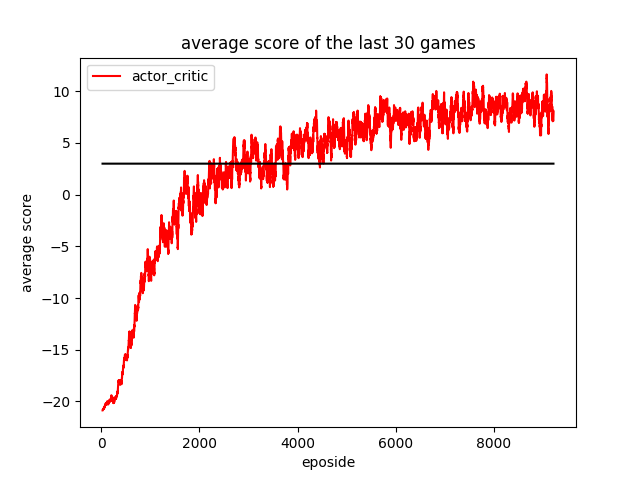
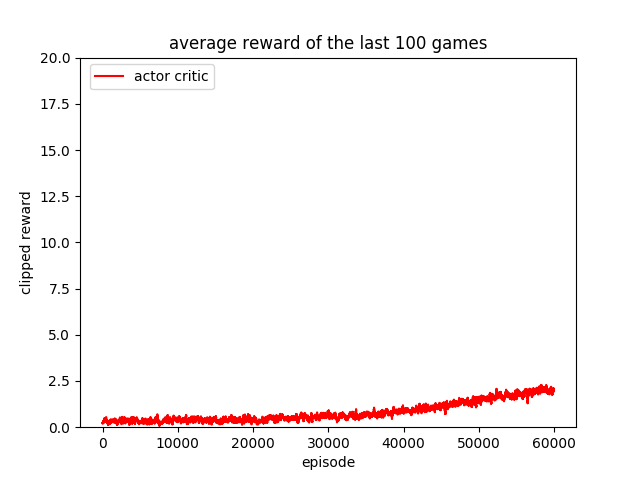

## MLDS Homework 4 Report
<p align="right">b05902127 劉俊緯 b05902013 吳宗翰</p>

### 4-1 Policy Gradient

#### 4-1-1 Policy Gradient model

##### Model

| layer  | RGB image from observation     | Shape                      |
| ------ | ------------------------------ | -------------------------- |
| perpro | TA的preprocess code.           | observation -> 80*80 image |
| hidden | Dense(128 , activation='relu') | (None,6400) -> (None,128)  |
| output | Dense(6,activation='softmax')  | (None,128) -> (None,6)     |

##### Details

| Details        | Parameteres                   |
| -------------- | ----------------------------- |
| Optimizer      | pyTorch's 預設 Adam， lr=1e-4 |
| Discount value | 0.99                          |

#### 4-1-2 Plot the learning curve to show the performance of your Policy Gradient on Pong 

</img>

#### 4-1-3 Implement 1 improvement method on page 8
##### Describe your tips for improvement 

* variance reduction - 加入 baseline
* 我們使用最靠近現在的10000步的rewards(包含被discount的部份)作為我們的mean。
* 要更新參數的時候，計算loss前的reward會-= mean。

##### Learning curve 

* 有baseline的learning curve一起畫在上面了。

##### Compare to the vallina policy gradient

* 我們會看到一般的pg相較於reduce variance的版本，會學習的非常緩慢。因為一般的pg variance非常大。原本在計算pg的公式的時候，因為我們不會知道policy的期望值是多少，所以才用採樣的方式去逼近。但是要是原本的distribution variance非常大，那麼採樣的可信度會大幅下降。例如只要採樣時的variance變大，在同個信賴區間的機率就會變低。
* 而為什麼增加baseline就會降低variance，這件事情在課堂上已經有證明了。
* 因此，我認為一般的pg可能因為期望值預測不準確導致學習叫緩慢。

>  proof : https://en.wikipedia.org/wiki/Variance_reduction

### 4-2 Deep Q Learning

#### 4-2-1 DQN Model

1. Network Structure 

```
# CNN * 3 + Dense * 2
CNN (in_channel=4, out_channel=16, kernel=8, stride=4) + ReLU
CNN (in_channel=16, out_channel=32, kernel=4, stride=2) + ReLU
CNN (in_channel=32, out_channel=64, kernel=3, stride=1) + ReLU
Dense(64*7*7, 512) + ReLU
Dense(512, 4) (action數是4)
```

2. Training method
	- batch size: 32
	- Optimizer: RMSProp, lr = $1.5 \times 10^{-4}$
	- Loss function: mse

3. DQN parameter
	- 使用Double DQN
	- 更新online network的頻率：4 timestamp
	- 更新target network的頻率：1000 timestamp
	- $\gamma = 0.99$
	- $\epsilon$ greedy使用Linear Decay，總共訓練500萬個iteration，不過只有在前面$0.3 \times 5000000$個iteration從1降到0.025。其餘的iteration都是$\epsilon=0.025$

#### 4-2-2 Learning Curve 

</img>

#### 4-2-3 Implement 1 improvement method

1. Tips
	- 基於第一題的Double DQN再加上Dueling上去
	- 基本上就按照投影片上面所述在最後一層做分岔然後再加起來，簡單更改network structure而已

2. Learning Curve

</img>

3. Compare to origin one
	- 由圖看出有沒有多加上Dueling在收斂時間上並沒有太大的差距，另外在最終的表現上也差不多
	- 由圖看出在Dueling + Dobule DQN在後期會有大震盪的狀況，而這是在原本只有Double DQN不曾出現的狀況

### 4-3 Actor Critic

#### 4-3-1 Actor Critic Model

##### Pong

```
# Dense * 2
Input (80 * 80)
Linear (6400, 256) + ReLU
-> Actor  : Linear (256, 2) + Softmax 
-> Critic : Linear (256, 1)
```
其他參數：
- Optimizer: adam, lr=$10^{-4}$
- Reward Discount: 0.99

##### Breakout

```
# CNN * 3 + Dense * 2
CNN (in_channel=4, out_channel=16, kernel=8, stride=4) + ReLU
CNN (in_channel=16, out_channel=32, kernel=4, stride=2) + ReLU
CNN (in_channel=32, out_channel=64, kernel=3, stride=1) + ReLU
-> Actor : 
	Linear (64 * 7 * 7, 512) + ReLU -> Linear (512, 4) + Softmax
-> Critic : 
	Linear (64 * 7 * 7, 512) + ReLU -> Linear (512, 1)
```

#### 4-3-2 Learning Curve
| Pong | Breakout |
| :-----: | :-----: |
| </img>| </img>|
可以看到Actor Critic在Pong上面表現的跟使用單純Policy Gradient差不多，不過breakout則是train不太起來。不過在後面有看到是有上升趨勢的，在4-3-3inference別人的A3C就看到他跑起來了，因此估計是跑得起來的。另外也有猜測像是Breakout這類有明顯reward的遊戲使用DQN就算很穩了。
#### 4-3-3 One improvement method of Actor-Critic

##### Model Description

```
# A3CLSTM
CNN (in_channel=4, out_channel=32, kernel=5, stride=1) + Maxpooling + ReLU
CNN (in_channel=32, out_channel=32, kernel=5, stride=1) + Maxpooling + ReLU
CNN (in_channel=32, out_channel=64, kernel=3, stride=1) + Maxpooling + ReLU
h, c = LSTM(1024, 512)
-> Actor  : Linear (512, action_num) + Softmax
-> Critic : Linear (512, 1)
```

其他參數：
- Optimizer: Shared Adam, lr=$10^{-4}$
- Number of process: 4

##### Learning Curve

| Policy Gradient | A3C |
| :-----: | :-----: |
| </img>| </img>|

| Double DQN | A3C |
| :-----: | :-----: |
| </img>| </img>|

上面第一個表格是pong的Learning Curve，下面第二個表格則是breakout的Learning Curve。可以明顯看到使用A3C的效能遠高於我們原本的DQN以及Policy Gradient。

##### Reference
- https://github.com/dgriff777/rl_a3c_pytorch

#### 分工表
- 4-1: b05902127 劉俊緯
- 4-2: b05902013 吳宗翰
- 4-3: b05902013 吳宗翰
