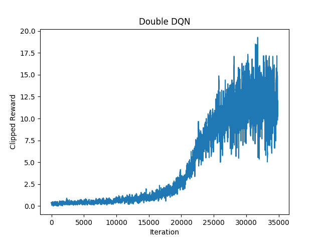
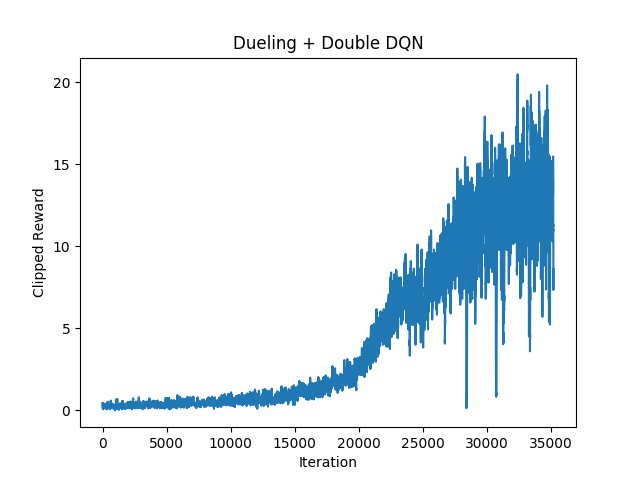

## MLDS Homework 4 Report
<p align="right">b05902127 劉俊緯 b05902013 吳宗翰</p>

### 4-1 Policy Gradient


### 4-2 Deep Q Learning

#### DQN Model

1. Network Structure 

```
# CNN * 3 + Dense * 2
CNN (in_channel=4, out_channel=16, kernel=8, stride=4) + ReLU
CNN (in_channel=16, out_channel=32, kernel=4, stride=2) + ReLU
CNN (in_channel=32, out_channel=64, kernel=3, stride=1) + ReLU
Dense(64*7*7, 512) + ReLU
Dense(512, 4) (action數是4)
```

2. Training method
	- batch size: 32
	- Optimizer: RMSProp, lr = $1.5 \times 10^{-4}$
	- Loss function: mse

3. DQN parameter
	- 使用Double DQN
	- 更新online network的頻率：4 timestamp
	- 更新target network的頻率：1000 timestamp
	- $\gamma = 0.99$
	- $\epsilon$ greedy使用Linear Decay，總共訓練500萬個iteration，不過只有在前面$0.3 \times 5000000$個iteration從1降到0.025。其餘的iteration都是$\epsilon=0.025$

#### Learning Curve 

</img>

#### Implement 1 improvement method

1. Tips
	- 基於第一題的Double DQN再加上Dueling上去
	- 基本上就按照投影片上面所述在最後一層做分岔然後再加起來

2. Learning Curve

</img>

3. Compare to origin one
	- 由圖看出有沒有多加上Dueling在收斂時間上並沒有太大的差距，另外在最終的表現上也差不多
	- 由圖看出在Dueling + Dobule DQN在後期會有大震盪的狀況，而這是在原本只有Double DQN不曾出現的狀況

### 4-3 Actor Critic
